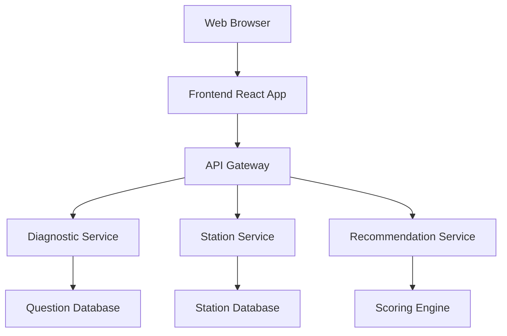

# Design Document

## Overview

山手線駅診断アプリは、ユーザーの好みや生活スタイルに基づいて最適な山手線の駅を推薦するWebアプリケーションです。診断質問への回答を通じてユーザープロファイルを構築し、各駅の特徴データとマッチングして適合度を算出します。

システムは以下の主要機能を提供します：
- 多角的な診断質問による好み分析
- 山手線全29駅の包括的データベース
- スコアリングアルゴリズムによる適合度計算
- 推薦理由付きの結果表示
- 直感的なユーザーインターフェース

## Architecture

システムはクライアント・サーバー分離型のWebアプリケーションとして設計します。



### Frontend Layer
- React.jsベースのSPA（Single Page Application）
- レスポンシブデザインでモバイル対応
- 状態管理にRedux Toolkitを使用

### Backend Layer
- Node.js + Express.jsによるRESTful API
- マイクロサービス指向の設計
- JSON形式でのデータ交換

### Data Layer
- JSONファイルベースのデータストレージ
- 駅情報と質問データの静的管理

## Components and Interfaces

### 1. Diagnostic Service
診断質問の管理と回答処理を担当

**主要メソッド:**
- `getQuestions()`: 診断質問一覧を取得
- `submitAnswer(questionId, answer)`: 回答を記録
- `getUserProfile(answers)`: 回答からユーザープロファイルを生成

### 2. Station Service
山手線駅データの管理

**主要メソッド:**
- `getAllStations()`: 全駅情報を取得
- `getStationById(id)`: 特定駅の詳細情報を取得
- `getStationFeatures(id)`: 駅の特徴データを取得

### 3. Recommendation Service
推薦アルゴリズムの実行

**主要メソッド:**
- `calculateScores(userProfile, stations)`: 適合度スコア計算
- `generateRecommendations(scores)`: 上位推薦駅の選出
- `explainRecommendation(station, userProfile)`: 推薦理由の生成

### 4. Frontend Components
- `DiagnosticWizard`: 診断フロー全体の制御
- `QuestionCard`: 個別質問の表示と回答収集
- `ProgressBar`: 診断進捗の視覚化
- `RecommendationResult`: 推薦結果の表示
- `StationDetail`: 駅詳細情報の表示

## Data Models

### Question Model
```typescript
interface Question {
  id: string;
  category: 'housing' | 'transport' | 'commercial' | 'culture' | 'price';
  text: string;
  options: QuestionOption[];
  weight: number;
}

interface QuestionOption {
  id: string;
  text: string;
  value: number;
  tags: string[];
}
```

### Station Model
```typescript
interface Station {
  id: string;
  name: string;
  nameEn: string;
  location: {
    latitude: number;
    longitude: number;
  };
  features: StationFeatures;
  description: string;
}

interface StationFeatures {
  housing: {
    rentLevel: number; // 1-5 scale
    familyFriendly: number;
    quietness: number;
  };
  transport: {
    accessibility: number;
    connections: string[];
    walkability: number;
  };
  commercial: {
    shopping: number;
    restaurants: number;
    convenience: number;
  };
  culture: {
    entertainment: number;
    history: number;
    nightlife: number;
  };
  price: {
    costOfLiving: number;
    diningCost: number;
  };
}
```

### User Profile Model
```typescript
interface UserProfile {
  preferences: {
    housing: number;
    transport: number;
    commercial: number;
    culture: number;
    price: number;
  };
  priorities: string[];
  answers: Answer[];
}

interface Answer {
  questionId: string;
  selectedOption: string;
  timestamp: Date;
}
```

### Recommendation Model
```typescript
interface Recommendation {
  station: Station;
  score: number;
  rank: number;
  explanation: RecommendationExplanation;
}

interface RecommendationExplanation {
  matchingFeatures: string[];
  strengths: string[];
  considerations: string[];
}
```

## Correctness Properties

*A property is a characteristic or behavior that should hold true across all valid executions of a system-essentially, a formal statement about what the system should do. Properties serve as the bridge between human-readable specifications and machine-verifiable correctness guarantees.*

### Property 1: Answer recording and progression
*For any* diagnostic question and valid answer, submitting the answer should record it in the user profile and advance to the next question in the sequence
**Validates: Requirements 1.2**

### Property 2: Complete analysis execution
*For any* complete set of diagnostic answers, the system should execute preference analysis and generate user profile data
**Validates: Requirements 1.3**

### Property 3: Recommendation completeness
*For any* completed analysis, the system should generate exactly 3 station recommendations with scores, reasons, and station features
**Validates: Requirements 1.4, 4.1**

### Property 4: Answer weighting consistency
*For any* user answer selection, the system should apply appropriate weighting based on question importance and record the weighted value
**Validates: Requirements 2.4**

### Property 5: Category coverage validation
*For any* question set, each of the five categories (housing, transport, commercial, culture, price) should contain multiple questions
**Validates: Requirements 2.2**

### Property 6: Station data completeness
*For any* station in the system, it should contain all required fields: features, location, description, and access information
**Validates: Requirements 3.2**

### Property 7: Comprehensive scoring
*For any* user profile, the recommendation calculation should generate compatibility scores for all 29 Yamanote line stations
**Validates: Requirements 3.3**

### Property 8: Recommendation explanation completeness
*For any* recommended station, the explanation should include compatibility score, matching features, and relationship between user answers and station characteristics
**Validates: Requirements 4.2, 4.3**

### Property 9: Progress tracking consistency
*For any* diagnostic session in progress, the system should display accurate progress information reflecting the current question position
**Validates: Requirements 5.2**

### Property 10: Error handling completeness
*For any* error condition, the system should display an appropriate error message and provide recovery options to continue or restart
**Validates: Requirements 5.5**

## Error Handling

### Input Validation
- 質問回答の形式検証
- 不正なデータ入力の拒否
- セッション状態の整合性チェック

### System Errors
- データ読み込み失敗時の代替処理
- 計算エラー時のフォールバック
- ネットワーク接続問題への対応

### User Experience
- 明確なエラーメッセージの表示
- 診断再開オプションの提供
- 部分的な結果の保存と復旧

## Testing Strategy

### Unit Testing
Jest + React Testing Libraryを使用してコンポーネントとサービスの単体テストを実装します。

**対象範囲:**
- 診断ロジックの個別機能
- スコアリングアルゴリズムの計算精度
- データ変換とバリデーション
- UI コンポーネントの動作

### Property-Based Testing
fast-checkライブラリを使用してプロパティベーステストを実装します。各テストは最低100回の反復実行を行い、ランダムな入力に対してシステムの正確性を検証します。

**実装要件:**
- 各正確性プロパティに対して1つのプロパティベーステストを作成
- テストコメントで対応する設計文書のプロパティを明記
- フォーマット: `**Feature: yamanote-station-finder, Property {number}: {property_text}**`
- 最低100回の反復実行設定

**テスト対象:**
- 診断フローの状態遷移
- 推薦アルゴリズムの一貫性
- データ整合性の維持
- ユーザーインターフェースの応答性

### Integration Testing
- API エンドポイント間の連携
- フロントエンド・バックエンド統合
- データフロー全体の検証